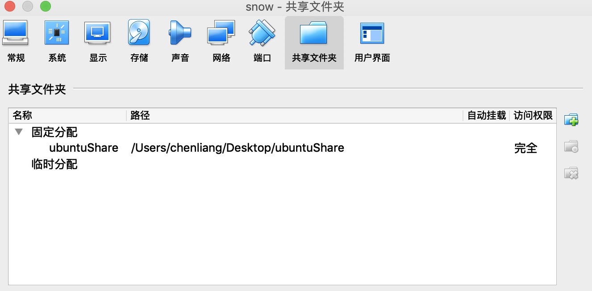

<script type="text/javascript"
   src="http://cdn.mathjax.org/mathjax/latest/MathJax.js?config=TeX-AMS-MML_HTMLorMML">
</script>
### 配置共享文件夹

在共享文件设置中关联主机的的共享文件夹，选择固定分配，具体步骤如下

1.共享文件夹的配置



2.开启ubuntu的增强功能 - devices->insert geuset xxx

3.

```
sudo apt install nfs-common
sudo apt install cifs-uitls
sudo mount -t vboxsf <macShare>  <ubuntuShare>
```


### ubuntu安装python
sudo apt install python-pip python-dev

配置python虚拟开发环境

```
pip install virtualenv

virtualenv --system-site-packages -p python2.7  ./venv #创建一个虚拟环境

source ./bin/active #进入虚拟环境

deactivate #退出
```

ubuntu安卓的python不带tkinter库，在使用matplotlib会出错

因为tkinter不是第三方库，因此不能用pip安装，通过下面命令来安装

```
sudo apt install python-tk
```

### python 安装tensorflow

```
pip install --upgrade pip
pip list

pip install --upgrade tensorflow 
pip install --user --upgrade tesorflow （该命令即使在虚拟环境下也会安装的home目录）
```

### tensorflow
tensorflow 的架构设计为client - service模式
client负责图的构建，图由tensor和operation构成，
service:Session，run运行客户端构建的图，这个计算过程可以是GPU，CPU，TPC来运行，并且支持分布式。

### tensor(张量)

#### 数学的维度
在一定的前提下描述一个数学对象所需要的参数个数，完整表述应该为"对象X基于前提A是n维"；
通常的理解是“点是0维，直线是1维，平面是2维，体是3维”，实际上这种说法中提到的概念是“前提”，而不是”被描述对象“，被描述对象均是“点”。故其完整的描述应该为“点基于点是0维，点基于直线是1维，点基于平面是二维，点基于体是三维”，再进一步解释，在点上描述(定位)一个点就是点本身，不需要参数；在直线上描述(定位)一个点，需要一个参数(坐标值)，在平面上描述(定位)一个点，需要2个参数(坐标值)；在体上描述(定位)一个点，需要3个参数(坐标值)。

再延伸一下，如果我们改变‘对象’就会得到不同的结论，如："直线基于平面是4维，直线基于体是6维，平面基于体是9维"

### CNN笔记
卷积神经网络是干嘛的？

我们之前学图像处理遇到的卷积，一般来说，这个卷积核是已知的，比如各种边缘检测算子，高斯模糊这些，都是已经知道卷积核的，然后再与图像进行卷积运算。然而深度学习中的卷积神经网络卷积核是未知的，我们训练一个神经网络，就是要训练得出这些卷积核，这些卷积核就相当于单层感知器的那些参数W，可以把这些待学习的卷积核看成是神经网络的训练参数W。

#### 卷积网络中的结构
首先来看看几个概念，全连接层，局部连接层，权值共享

##### 全连接层(Fully Connected layer)
全连接层的每一个节点都与上一层每个节点连接，比如上一个层有n个节点(数据类型为一维)，则全连接层中的一个节点的输出等于上一层n个节点与n个参数作用产生。 从这也可以看出全连接容易造成过度拟合的现象

##### 局部连接层
每个神经元仅与输入神经元的一块区域连接，这块局部区域称作感受野(receptive field)。在图像卷积操作中，神经元在空间维度(spatial dimension)是局部连接，但在深度上是全连接

##### 权重共享
计算同一个深度切片的神经元时采用的滤波器是共享的，因此经过一个滤波器得到的输出，往往只能提前一个特征，在卷积层，通常采用多组卷积核提取不同特征值，不同深度切片的神经元权重是不共享的。

用一张图片为输入源来解释以上三个概念
一张大小为W * H，如果使用全连接网络，生成一张X * Y的feature map,需要 \\(W * H * X * Y \\)个参数，如果原图长宽是10^2级别的，而且XY大小和WH差不多，那么这一层的参数个数就是10^8~10^12级别。

   这么多的参数肯定是不行的，因为输出的每一个像素都与原图片所有像素有连接，每一个连接都需要一个参数。因为图像都是局部相关的，可以让输出层的每一个像素只与输入层图片的一个局部向连，那么需要的参数个数就会大大减少；比如只与F*F的一个小块有连接，也就是输出层的像素，是通过原图这个F * F的一个小方形中的像素计算出来，这时候需要的参数是W * H * F * F，如果F在10以内，那么需要的参数只有10^5~10^6级别，相比全连接小了很多很多。
   
   但是可以发现参数量还是很大；图片有另一个特征：图片的底层特征是与特征在图片中的位置无关。同一深度的点可以共享同一组F * F的参数，这样同一层的参数只有F * F个，一下少了很多。但这组F*F只能得到一张feature map,一般有多组参数，分别经过卷积后就可以有好几层feature map


##### softmax
可以理解为归一化，如目前图片分类有一百种，哪经过softmax层的输出就是一个一百维的向量。向量中的第一个值就是当前图片属于第一类的概率值，向量中的第二个值为属于第二类的概率值，这一百维之和为1.
softmax的输入和输出层的维度一直，如果一样，需要在输入至softmax层之前通过一层全连接层。

