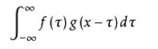

#### 配置共享文件夹

在共享文件设置中关联主机的的共享文件夹，选择固定分配，具体步骤如下

1.共享文件夹的配置


2.开启ubuntu的增强功能 - devices->insert geuset xxx

3.

```
sudo apt install nfs-common
sudo apt install cifs-uitls
sudo mount -t vboxsf <macShare>  <ubuntuShare>
```


#### ubuntu安装python
sudo apt install python-pip python-dev

配置python虚拟开发环境

```
pip install virtualenv

virtualenv --system-site-packages -p python2.7  ./venv #创建一个虚拟环境

source ./bin/active #进入虚拟环境

deactivate #退出
```

ubuntu安卓的python不带tkinter库，在使用matplotlib会出错

因为tkinter不是第三方库，因此不能用pip安装，通过下面命令来安装

```
sudo apt install python-tk
```

#### python 安装tensorflow

```
pip install --upgrade pip
pip list

pip install --upgrade tensorflow 
pip install --user --upgrade tesorflow （该命令即使在虚拟环境下也会安装的home目录）
```

#### tensorflow
tensorflow 的架构设计为client - service模式
client负责图的构建，图由tensor和operation构成，
service:Session，run运行客户端构建的图，这个计算过程可以是GPU，CPU，TPC来运行，并且支持分布式。

#### CNN

卷积的物理意义：
系统某一时刻的输出是由多个输入共同作用(叠加)的结果。



上图为卷积的公式，放在图像分析里，f(x)可以理解为原始像素点(source pixel),所有的原始像素点叠加起来，就是原始图了。  

g(x)可以成为作用点，所有作用点合起来我们称之为卷积核(Convolution kernel)  

卷积核上所有作用点依次作用于原始像素点后(即乘起来)，线性叠加的输出结果，即是最终卷积的输出，也是我们想要的,destination pixel

谈谈卷积的意义，一个公式出来是为了解决某一类问题，卷积也是。


